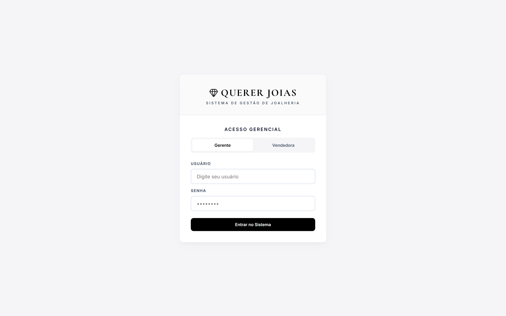
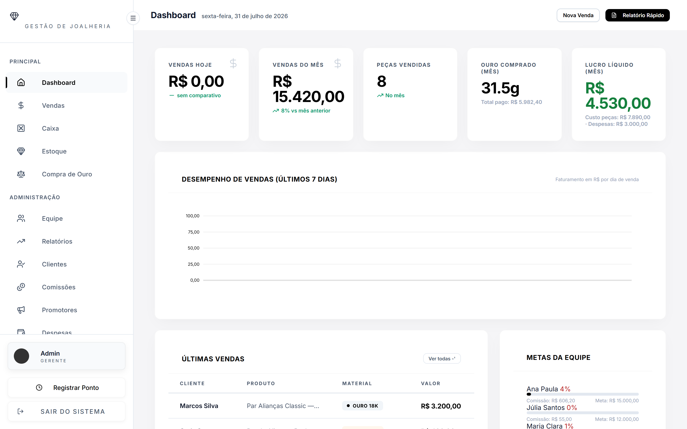
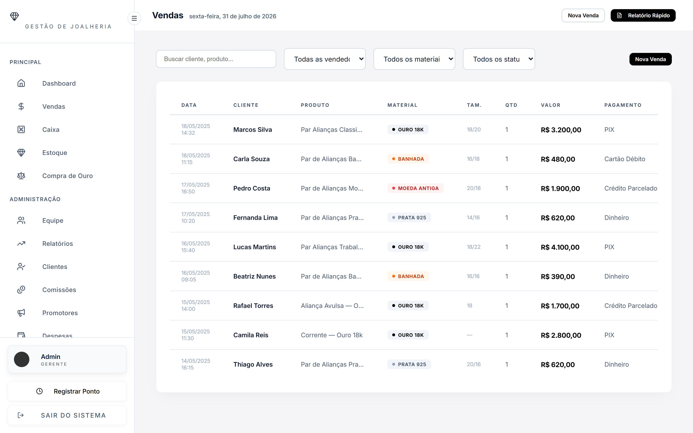
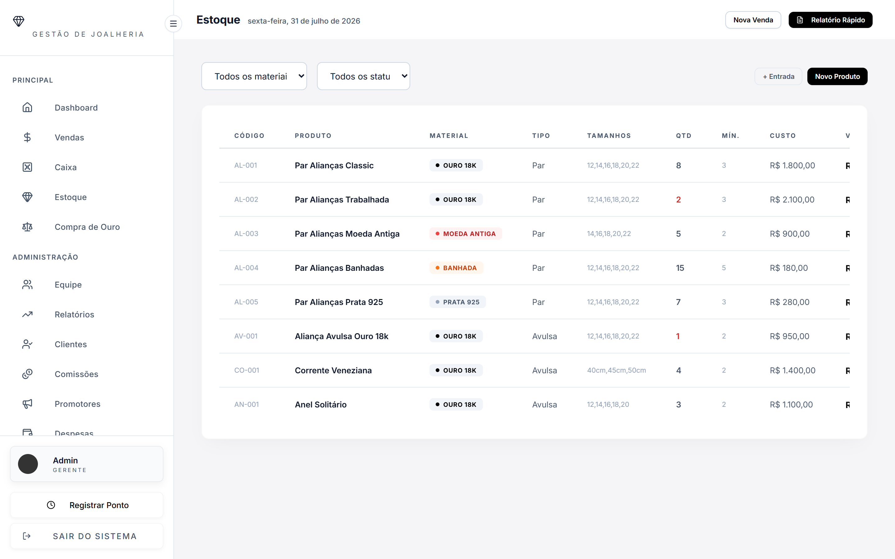
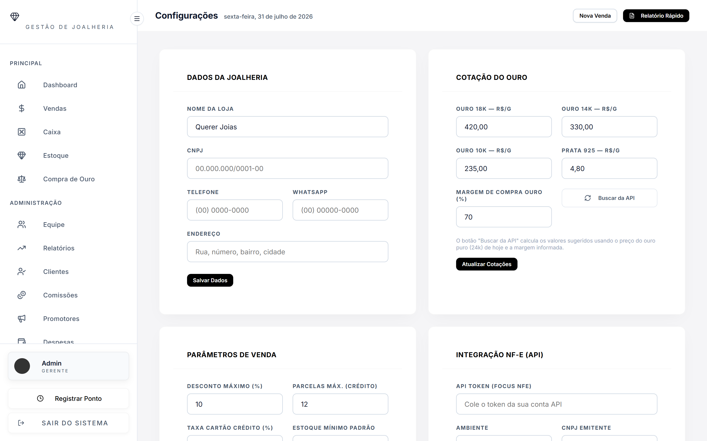
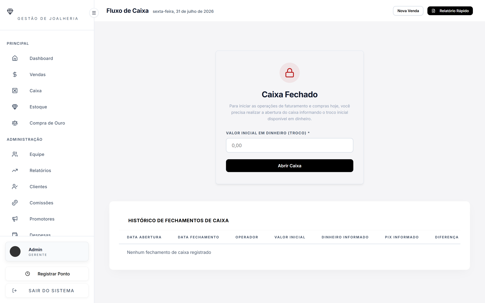
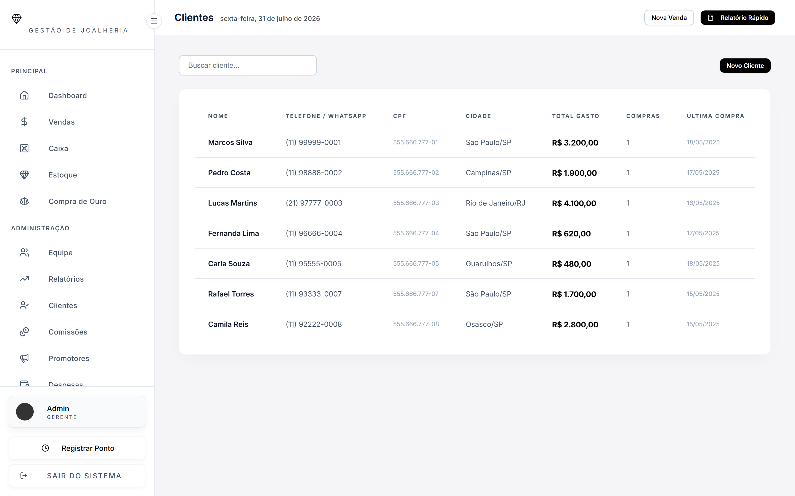
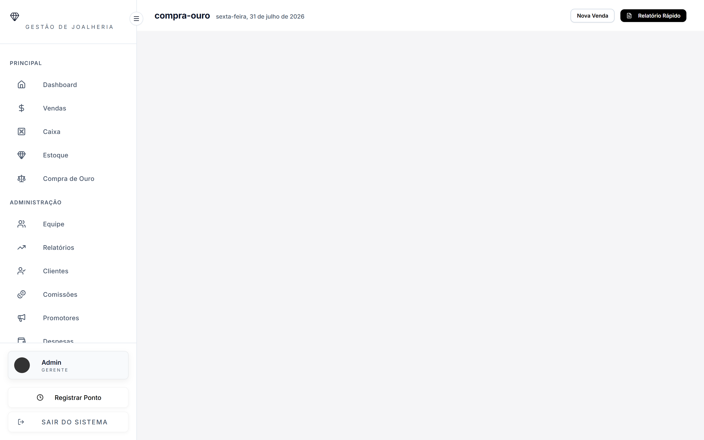
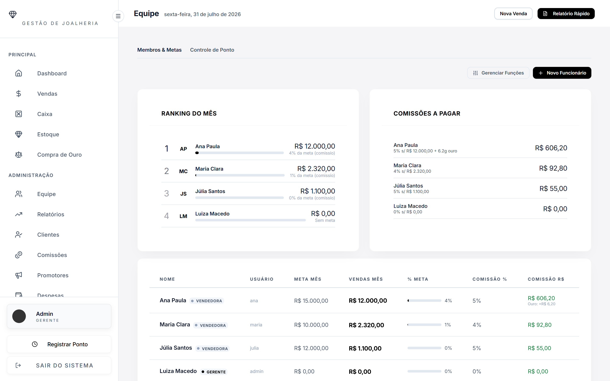
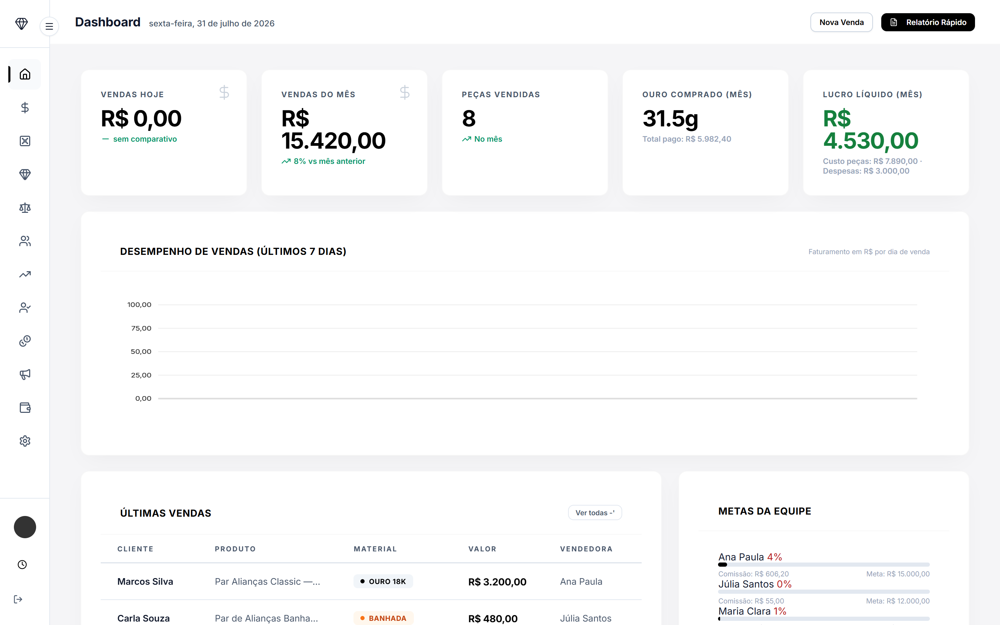

<h1 align="center">
  <br>
  
  <br>
  Alliance - Sistema de Gestão para Joalherias
  <br>
</h1>

<p align="center">
  <a href="#sobre">Sobre</a> •
  <a href="#funcionalidades">Funcionalidades</a> •
  <a href="#telas">Telas e Design</a> •
  <a href="#tecnologias">Tecnologias</a> •
  <a href="#como-executar">Como Executar</a>
</p>

## Sobre

**Alliance** é um sistema desktop moderno e altamente otimizado construído especificamente para a gestão de **joalherias**. Focado em performance e segurança, ele oferece um painel administrativo completo com controle de fluxo de caixa, gestão de estoque e comissionamento, e emissão simplificada de Notas Fiscais Eletrônicas (NF-e).

O sistema foi desenhado com um visual premium utilizando o conceito de **Glassmorphism**, garantindo não apenas utilidade extrema, mas uma estética agradável e limpa condizente com a indústria de joias.

---

## Funcionalidades

- 💰 **Painel de Vendas:** Lançamento de vendas, orçamentos e recebimentos parciais.
- 📦 **Gestão de Estoque Inteligente:** Controle rígido de produtos por gramatura e alerta automático de estoque mínimo (ex: anéis, pulseiras, prata e ouro).
- 🧾 **Integração Fiscal (API de NF-e):** Geração, autorização e download de PDFs de notas fiscais com um clique diretamente via integração com a Focus NFe.
- 👥 **Controle de Equipe:** Múltiplas funções de acesso (gerente e vendedora) e cálculo autônomo de metas e comissões de vendas.
- 🤝 **Compra de Ouro:** Gestão especializada na aquisição e conversão de peso/quilates de metais preciosos (ouro 18k, 24k).
- 📊 **Dashboard Estratégico:** Acompanhamento de lucro líquido, gráfico histórico de faturamento e total de vendas em tempo real.
- 🔒 **Banco de Dados Seguro:** O sistema opera offline com banco local **SQLite** protegido contra adulteração do ambiente cliente.

---

## Telas

### 📊 Dashboard e Métricas
O painel inicial resume toda a saúde da empresa com widgets responsivos e gráficos diretos.


### 💎 PDV e Emissão de Notas
Um fluxo de vendas limpo, organizado, e o mais importante: com botão integrado direto de emissão de NF-e (Status "autorizado").


### 📦 Controle de Estoque


### ⚙️ Painel Fiscal e Configurações
Área restrita de gestores para token e credenciais do contador (CNPJ, Regime, etc.) isolada das vendedoras.


<details>
  <summary><b>🖼️ Clique para expandir e ver mais telas do sistema</b></summary>
  
  #### Caixa e Fluxo Diário
  
  
  #### Carteira de Clientes
  
  
  #### Compra de Ouro (Cotações Integradas)
  
  
  #### Comissões e Vendedoras
  
  
  #### Design Responsivo (Sidebar Toggle)
  
</details>

---

## Tecnologias

A aplicação combina o melhor do ecossistema web trazido para o Desktop:

*   **Electron.js:** Wrapper multiplataforma nativo.
*   **Vite:** Build rápido e eficiente do módulo cliente.
*   **Javascript Vanilla / ES6:** Front-end leve e de alta performance sem excesso de pacotes.
*   **SQLite3:** Banco de dados relacional integrado operando localmente no Processo Principal (segurança absoluta).
*   **CSS Nativo:** Estilizações exclusivas (Glassmorphism e Neumorphism) sem dependências externas.
*   **Integração IPC (Inter-Process Communication):** Toda requisição do sistema flui por um canal blindado de segurança restrita `nodeIntegration: false`.

---

## Como Executar

### Pré-requisitos
Ter o [Node.js](https://nodejs.org/) instalado.

```bash
# Clone este repositório
$ git clone https://github.com/pedruu13/Alliance.git

# Entre na pasta
$ cd Alliance

# Instale as dependências
$ npm install

# Execute a aplicação no modo de desenvolvimento
$ npm run dev
```

### Gerando o Executável (.exe)
Para distribuir o sistema para uso na joalheria, gere o build completo para Windows:
```bash
$ npm run build
$ npm run package
```
O executável final ficará dentro da pasta `out/` pronto para instalação.
